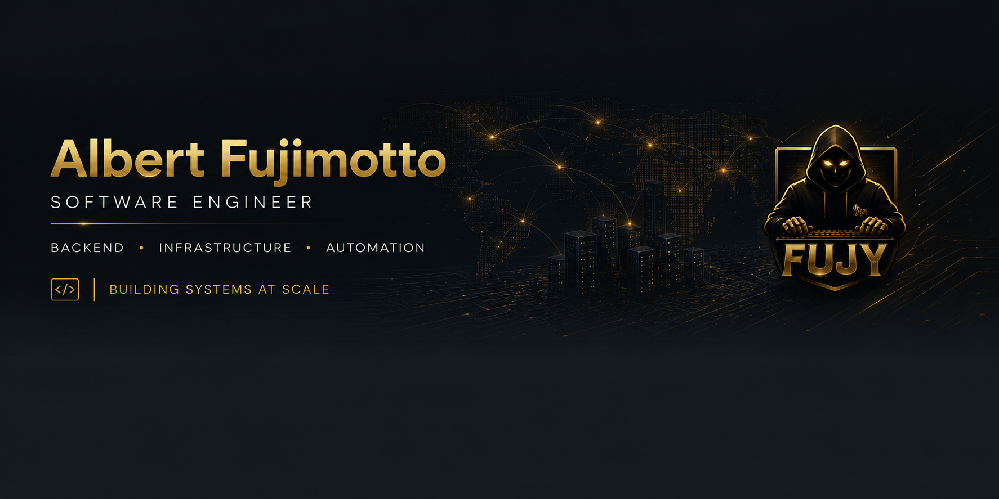

  

## About

I design and maintain large scale multiplayer systems, backend infrastructure and automation for **FPlayT**.

Focused on performance, scalability, reliability and engineering systems built to operate at scale.

---

## Core Expertise

### Backend & Engineering

### Databases

### Infrastructure & Systems

### Engineering Focus

---

## Current Focus

<table>
  <tr>
    <td width="20%" valign="top">
      
       
      <strong>Multiplayer Infrastructure</strong>
        
      Building and scaling robust distributed multiplayer systems.
    </td>
    <td width="20%" valign="top">
      
       
      <strong>Backend Systems</strong>
        
      Designing clean, reliable and high-performance backend services.
    </td>
    <td width="20%" valign="top">
      
       
      <strong>Internal Automation</strong>
        
      Automating processes and improving developer productivity at scale.
    </td>
    <td width="20%" valign="top">
      
       
      <strong>Performance &amp; Scalability</strong>
        
      Optimizing systems for maximum performance and horizontal scalability.
    </td>
    <td width="20%" valign="top">
      
       
      <strong>Large Scale Game Ecosystems</strong>
        
      Operating and evolving complex ecosystems with millions of interactions.
    </td>
  </tr>
</table>

---

## GitHub Analytics

  

### Building systems at scale

